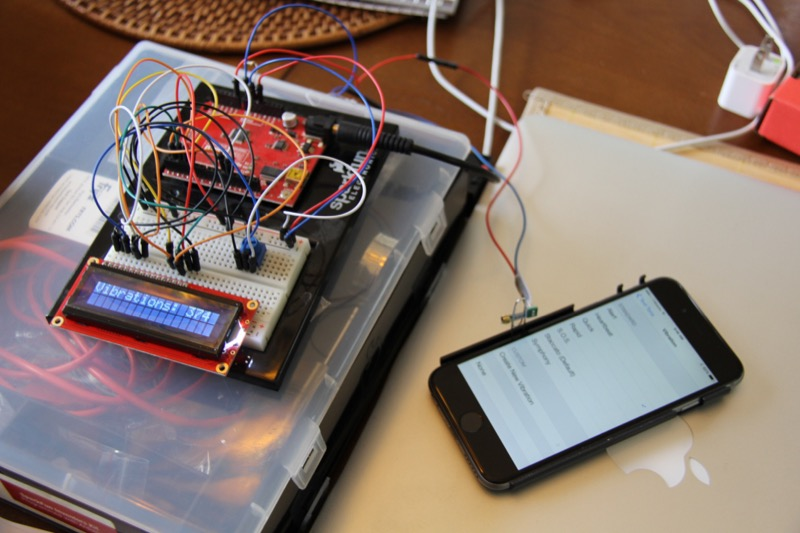

# Arduino Vibration Counter

This is a little Ardiuno fun I had. Started when I thought my iPhone was
vibrating without anything happening on the screen. It got me thinking
about [phantom vibration syndrome](https://en.wikipedia.org/wiki/Phantom_vibration_syndrome)
so I made this 'lil arduino project to see if I could capture any
vibrations while the phone was just lying around.

Of course, by the time I finished I'd fiddled with the phone settings
enough and the weird vibrations were no more. Oh well.

See the comments in the .ino file for more (still messy) details.

Here's what the final product looked like. It worked best with a paper-clip
holding the sensor tucked in the phone case.

